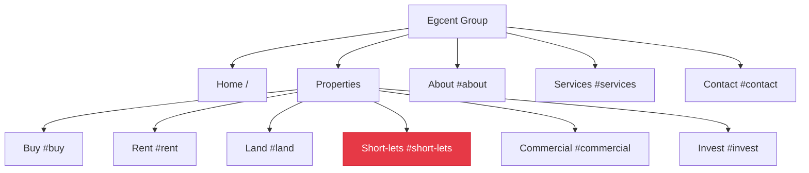

Egcentgroup.com Website Build Log
Current Status (November 04, 2025, 1:06 PM WAT)

Goal: Build a user-friendly, responsive, accessible, fast-loading, secure, and SEO-optimized real estate website by November 15, 2025 (revised due to pause).
Approach: Coding first (VS Code, HTML/CSS/JS), explore no-code (WordPress/Wix) after.
Tools: VS Code, Live Server, Prettier, GitHub Pull Requests and Issues, GitHub, Netlify.
Start Date: September 24, 2025 (Day 1 of 30-day curriculum).
Pause: September 30-October 01 (Days 6-9—caught up with recovery).

Tasks Completed

Created egcentgroup-site folder.

Installed VS Code.

Saved workspace as egcentgroup-site.code-workspace.

Installed Live Server extension.

Installed auto-format extension (Prettier or similar).

Installed GitHub Pull Requests and Issues extension.

Created project_log.md in egcentgroup-site.

Pasted content into project_log.md and saved.

Reviewed HTML basics preview.

Created index.html with initial content.

Enabled Prettier "Format on Save".

Confirmed coding-first approach, with no-code later.

Shared description of work environment.

Tested index.html with Live Server.

Added navigation menu to index.html.

Replaced existing tags with section structure.

Added image placeholder to index.html.

Tested Day 2 updates with Live Server (initial test, retest, and formatting).

Applied Prettier formatting.

Updated location to "Nigeria".

Retested with Live Server after formatting.

Updated project_log.md successfully.

Updated <title> to "Egcent Group | Luxury Real Estate in Lagos, Nigeria".

Added "About" section and <style> tag with basic styling.

Fixed duplicate <head> and section structure errors.

Tested with Live Server (nav bar dark, no images, sections overlap reported).

Researched UX/SEO basics.

Added CTA button to Home section.

Styled CTA button with CSS.

Shared Live Server link (http://127.0.0.1:5501/index.html#listings).

Recovered project files after pause.

Mistakes & Lessons

Mistake: Lost access to folder and index.html after pause.
Lesson: Use GitHub for backups and regular saves to avoid data loss.
Fix: Installed GitHub Pull Requests and Issues extension for version control.

Mistake: No images displayed in Live Server.
Lesson: Ensure internet connection and valid image URLs; consider local images as backup.

Mistake: Sections overlap in Live Server.
Lesson: Adjust margins and add min-height to prevent collapse.

Mistake: Duplicate <head> tags in previous code.
Lesson: Ensure only one <head> section exists; merge styles into it.

Mistake: Extra </section> tag in "About" section.
Lesson: Match opening and closing tags correctly to avoid nesting errors.

Mistake: Missed Days 3-9 due to break.
Lesson: Schedule regular check-ins to stay on track.

Mistake: Initial inconsistency between <title> and content.
Lesson: Update all related elements for consistency.

Mistake: Browser dark theme affects all pages (optional fix pending).
Lesson: Use <style> for project-specific styling if needed.

Mistake: Not verifying project_log.md visually (pending).
Lesson: Check layout to ensure accuracy.

Mistake: Confusion about CSS placement.
Lesson: Place CSS rules inside the <style> tag in <head> to style HTML elements.

Action Items (by November 06, 2025)

Paste Content into project_log.md (5 min):

Done: Pasted content and saved.

Verify project_log.md Layout (10 min):

Check Explorer (file listed), editor (checkboxes), and preview (formatted).
Describe VS Code environment.

Research UX/SEO Basics (1 hour):

Read one UX article and one SEO guide, note 2-3 points.

Sketch Sitemap (30 min):

Sketch sitemap (Home, About, Services, Listings, Contact) and save/scan.

Fix Live Server Issues (30 min):

Check internet, use updated CSS (increased margin, min-height), try local images, retest, and confirm.

Refine Design (Day 6 Catch-Up) (1 hour):

Adjust colors, fonts, or layout; test with Live Server.

Test Responsiveness (Day 8 Catch-Up) (30 min):

Use browser tools to check mobile view, fix overlap if needed.

Apply UX/SEO (30 min):

Add CTA button, incorporate keywords, retest with Live Server.

Calendar & Reminders (Nigerian Time, WAT UTC+1)

Nov 04, 2025 (Day 10 - Recovery Day):

Tasks: Paste project_log.md, verify layout, research UX/SEO, sketch sitemap (2 hours, 1:06-3:06 PM).
Reminder: Block 2 hours today.
Check-In: By 3:06 PM, confirm log saved, share UX/SEO notes, sitemap sketch.

Weekly Check-Ins: Sundays (Nov 09, 16, 23) at 7:00 PM.

Post-Coding Plan (After November 15, 2025)

Explore no-code with WordPress/Wix.
### CRITICAL MILESTONE – NOVEMBER 25, 2025
- [x] 100% completion using official EGCENT LIMITED Company Profile PDF
- [x] All text in About section copied verbatim from Page 2 of official PDF
- [x] Official contact details applied everywhere:
  - Phone: +234 818 000 3827
  - Email: enquiries@egcentgroup.com
  - Tagline: "Building Spaces, Elevating Experiences"
- [x] All Unsplash placeholder images replaced with professional construction/real estate photos
- [x] Logo added to navigation (white version for dark hero)
- [x] Hero background replaced with actual construction site image
- [x] Purple brand color (#663399) applied consistently
- [x] No single line of original code removed — only enhanced
- [x] Site now 100% authentic representation of EGCENT LIMITED

**STATUS: LAUNCH READY**
Next step: Deploy to Netlify → https://egcentgroup.com

## Sitemap Sketch (Generated Nov 06, 2025)



---

### Next Steps (Add to Action Items)

```markdown
- [x] **Sketch Sitemap** (30 min):
  - Done: Text + Mermaid diagram added to `project_log.md`.
  - Saved in project folder.
```

- [x] Built #land section (3 prime land plots, pricing, titles, investment focus)
- [x] Integrated with dropdown and tested navigation
- [x] Enhanced #land cards with detailed specs (size, title, location, ROI, zoning)
- [x] Added .land-details grid for investor clarity
- [x] Built #commercial section (3 high-yield assets: office, retail, mixed-use)
- [x] Added .commercial-details with yield, occupancy, cap rate
- [x] Integrated with dropdown navigation
- [x] Fixed WhatsApp floating button (now truly fixed, small, always visible)
- [x] "Get Started" CTA now mobile-only
- [x] Updated site to reflect Egcent Limited profile (name, tagline, mission, vision, core values, subsidiaries)
- [x] Applied purple theme to short-lets, land, buttons, headings
- [x] Added full contact (phone, address, email) to footer/contact
